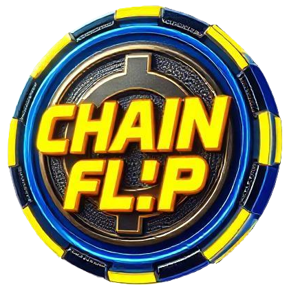

<p align="center">
  
</p>

<h2 align="center">A decentralized CoinFlip game leveraging Chainlink VRF and Automation.</h2>

<p align="center">
  <a href="LICENSE">
    
  </a>
  
  <a href="https://getfoundry.sh/">
    
  </a>
  <a href="https://nextjs.org/">
    
  </a>
  <a href="https://wagmi.sh/">
    
  </a>
  <a href="https://www.rainbowkit.com/">
    
  </a>
  <a href="https://chain.link/">
    
  </a>
  
</p>


---

### About ChainFlip

**ChainFlip** is a decentralized coin flip betting game, leveraging **Chainlink VRF** for provable randomness and **Chainlink Automation**. Players can create and join matches, with automatic payouts to the winner.

🛠 **This is a learning project** built to explore **smart contracts and web3 development**.  
🛑 **Currently deployed on:** **Amoy, Sepolia, and BNB Testnet**.  

🚀 [**Try ChainFlip on Vercel →**](https://chainflip-pink.vercel.app/)


## Features

- **Decentralized Betting**: Fair and transparent coin flip game.
- **Chainlink VRF Integration**: Ensures unbiased randomness for outcomes.
- **Automated Refunds**: Handles failed transactions and refunds automatically.
- **Flexible Configuration**: Owners can set minimum bet amounts and fees.
- **Chainlink Automation**: Automatically detects and resolves stuck matches.

## **Frontend Features**

The frontend is built with **Next.js**, **Wagmi** for blockchain interactions and **RainbowKit** for wallet connection.

#### **Matches**  
- 🏆 **Create a Match** – Players can create a new coin flip match by selecting a side and setting a bet amount.  
- 🔄 **Join a Match** – Players can join an existing match, taking the opposite side.  
- ❌ **Cancel a Match** – Match creators can cancel a match before it starts. If canceled, the player can withdraw their funds from the **Dashboard**.  

#### **Dashboard**  
- 📊 **Match Overview** – Users can view their **active matches**, **match history** with results, and overall **stats**.  

#### **Leaderboard**  
- 🥇 **Top Winners** – Displays the **top players** based on total winnings.  

#### **Admin Panel**  
- ⚙️ **Contract Owner Controls**:  
  - Set **fee percent**, **minimum bet amount**, and **timeout for stuck matches** (minutes before Chainlink automation cancels and refunds).  
  - 💰 **Withdraw accumulated fees**.


## Project Structure

```plaintext
chain-flip/
├── README.md                                # Project documentation
├── backend/                                 # Backend folder for smart contracts using Foundry
│   ├── foundry.toml                         # Foundry configuration file
│   ├── script/                              # Scripts for deployment and interaction
│   │   ├── DeployChainFlip.s.sol            # Deployment script for ChainFlip contract
│   │   ├── HelperConfig.s.sol               # Helper script for contract configuration
│   │   └── Interactions.s.sol               # Script for contract interactions
│   ├── src/                                 # Solidity source files
│   │   └── ChainFlip.sol                    # Main smart contract for the coin flip game
│   └── test/                                # Solidity test files
│       ├── Invariants/                      # Invariant tests (for formal verification)
│       │   └── ChainFlipInvariantsTest.t.sol
│       ├── fuzz/                            # Fuzz testing (randomized input tests)
│       │   └── ChainFlipFuzzTest.t.sol
│       ├── integration/                     # Integration tests (end-to-end)
│       │   └── ChainFlipIntegrationTest.t.sol
│       ├── mocks/                           # Mock contracts for testing
│       │   └── LinkToken.sol                # Mock Chainlink token contract
│       └── unit/                            # Unit tests (function-level tests)
│           └── ChainFlipUnitTest.t.sol
├── frontend/                                # Frontend folder using Next.js
│   ├── app/                                 # Next.js App Router
│   │   ├── admin/                           # Admin dashboard
│   │   │   └── page.tsx
│   │   ├── dashboard/                       # User dashboard
│   │   │   └── page.tsx
│   │   ├── globals.css                      # Global styles
│   │   ├── layout.tsx                       # Root layout component
│   │   ├── leaderboard/                     # Leaderboard page
│   │   │   └── page.tsx
│   │   ├── matches/                         # Matches listing page
│   │   │   └── page.tsx
│   │   ├── page.tsx                         # Main landing page
│   │   └── providers.tsx                    # Providers for context/state management
│   ├── components/                          # Reusable React components
│   │   ├── AdminDashboard.tsx               # Admin panel component
│   │   ├── FlipCoin.tsx                     # Coin flip animation component
│   │   ├── MatchCard.tsx                    # UI card for displaying matches
│   │   ├── Navbar.tsx                       # Navigation bar component
│   │   └── css/                             # CSS files
│   │       └── FlipCoin.css                 # Styles for FlipCoin animation
│   ├── config/                              # Configuration files
│   │   ├── chainflip.ts                     # Chain-specific configurations
│   │   ├── contracts.config.ts              # Smart contract addresses & ABIs
│   │   ├── wagmi.ts                         # Wagmi configuration for wallet connection
│   │   └── wagmiGenerate.config.ts          # Auto-generated Wagmi config
│   ├── eslint.config.mjs                    # ESLint configuration for linting
│   ├── next-env.d.ts                        # TypeScript environment file for Next.js
│   ├── next.config.ts                       # Next.js configuration file
│   ├── package-lock.json                    # Auto-generated lock file for dependencies
│   ├── package.json                         # Project dependencies and scripts
│   ├── postcss.config.mjs                   # PostCSS configuration (for Tailwind)
│   ├── public/                              # Static assets (images, videos, etc.)
│   │   ├── background.mp4                   # Background animation/video
│   │   ├── chainflip_logo.png               # Project logo
│   ├── tailwind.config.ts                   # Tailwind CSS configuration file
│   └── tsconfig.json                        # TypeScript configuration file
└──
```

## Getting Started

### Prerequisites

Make sure you have the following installed:

- [Node.js](https://nodejs.org/) (v18 or higher)
- [Foundry](https://book.getfoundry.sh/) for Solidity development
- [Git](https://git-scm.com/)

### Clone the Repository

```bash
git clone https://github.com/KMean/chain-flip.git
cd chain-flip
```

### Initialize Submodules

Ensure submodules are properly initialized to fetch all dependencies:

```bash
git submodule update --init --recursive
```

## Backend Setup

1. **Navigate** to the backend directory:
   ```bash
   cd backend
   ```
2. **Install dependencies**:
   ```bash
   forge install
   ```
3. **Copy environment variables**:
   ```bash
   cp .env.example .env
   ```

   Update `AMOY_RPC_URL`, `SEPOLIA_RPC_UR`, `BNBTESTNET_RPC_URL`, `CHAINLINK_VRF_AMOY_SUBSCRIPTION_ID`, `CHAINLINK_VRF_SEPOLIA_SUBSCRIPTION_ID`, `CHAINLINK_VRF_BNBTESTNET_SUBSCRIPTION_ID`, `ACCOUNT`, `POLYGON_SCAN_API_KEY`, `ETHERSCAN_API_KEY`, `BSCSCAN_API_KEY` in `.env`.

4. **Run tests**:
   ```bash
   forge test
   ```
   you should see all test passing
   ```bash

      [⠊] Compiling...
      [⠒] Compiling 7 files with Solc 0.8.26
      [⠑] Solc 0.8.26 finished in 2.55s
      Compiler run successful!

      Ran 4 tests for test/integration/ChainFlipIntegrationTest.t.sol:CoinFlipIntegrationTest
      [PASS] testClaimPrizeFlow() (gas: 869454)
      [PASS] testFulfillRandomWordsPicksAWinnerAndPaysOut() (gas: 2272347)
      [PASS] testFullFlowWithAutomation() (gas: 681365)
      [PASS] testMultipleMatches() (gas: 1152885)
      Suite result: ok. 4 passed; 0 failed; 0 skipped; finished in 9.19ms (4.45ms CPU time)

      Ran 11 tests for test/fuzz/ChainFlipFuzzTest.t.sol:ChainFlipFuzzTest
      [PASS] testFuzzCancelMatch(uint256) (runs: 1000, μ: 314847, ~: 314877)
      [PASS] testFuzzCannotJoinOwnMatch(uint256) (runs: 1000, μ: 316070, ~: 316104)
      [PASS] testFuzzCreateMatch(uint256) (runs: 1000, μ: 307484, ~: 307512)
      [PASS] testFuzzCreateMatchWithRandomBetAmounts(uint256) (runs: 1000, μ: 306419, ~: 306468)
      [PASS] testFuzzInvalidJoin(uint256,uint256) (runs: 1000, μ: 32728, ~: 32792)
      [PASS] testFuzzJoinMatch(uint256) (runs: 1000, μ: 664361, ~: 664392)
      [PASS] testFuzzJoinMatchWithRandomBetAmounts(uint256) (runs: 1000, μ: 322694, ~: 317882)
      [PASS] testFuzzPerformUpkeep(uint256) (runs: 1000, μ: 684891, ~: 685030)
      [PASS] testFuzzSetFee(uint256) (runs: 1000, μ: 24076, ~: 24327)
      [PASS] testFuzzVRFCallback(uint256) (runs: 1000, μ: 694265, ~: 694265)
      [PASS] testFuzzWithdrawFees(uint256) (runs: 1000, μ: 718352, ~: 718389)
      Suite result: ok. 11 passed; 0 failed; 0 skipped; finished in 221.28ms (1.14s CPU time)

      Ran 52 tests for test/unit/ChainFlipUnitTest.t.sol:CoinFlipUnitTest
      [PASS] testCancelMatch() (gas: 310916)
      [PASS] testCannotCancelCompletedMatch() (gas: 657418)
      [PASS] testCannotCancelMatchNotCreatedByCaller() (gas: 301809)
      [PASS] testCannotCreateMatchWithInsufficientFunds() (gas: 22256)
      [PASS] testCannotJoinInvalidMatch() (gas: 315642)
      [PASS] testCannotJoinMatchWithDifferentBetAmount() (gas: 313870)
      [PASS] testCannotJoinOwnMatch() (gas: 312119)
      [PASS] testCheckUpkeepNoStuckMatches() (gas: 12362)
      [PASS] testCheckUpkeepWithStuckMatches() (gas: 663446)
      [PASS] testCompleteMatchFlow() (gas: 690716)
      [PASS] testCreateMatch() (gas: 303977)
      [PASS] testCreatingMatchEmitsEvent() (gas: 300833)
      [PASS] testETHRejection() (gas: 15009)
      [PASS] testExactAmountJoinNoRefund() (gas: 658090)
      [PASS] testFallbackReverts() (gas: 15193)
      [PASS] testFeeUpdatedEmitsEvent() (gas: 20917)
      [PASS] testFeesWithdrawnEmitsEvent() (gas: 712966)
      [PASS] testGetCollectedFees() (gas: 695266)
      [PASS] testGetCurrentMatchId() (gas: 544580)
      [PASS] testGetFeePercent() (gas: 20432)
      [PASS] testGetMatch() (gas: 303583)
      [PASS] testGetMatchResult() (gas: 688956)
      [PASS] testGetMatchState() (gas: 690753)
      [PASS] testGetMatchWinner() (gas: 689195)
      [PASS] testGetMatchesByPlayer() (gas: 307518)
      [PASS] testGetMatchesPaginated() (gas: 2251146)
      [PASS] testGetPlayerStats() (gas: 1270496)
      [PASS] testGetRefunds() (gas: 308717)
      [PASS] testGetTopWinners() (gas: 1470879)
      [PASS] testGetTotalAmountInvested() (gas: 1223922)
      [PASS] testGetTotalAmountWon() (gas: 1084663)
      [PASS] testGetTotalWinnings() (gas: 1086048)
      [PASS] testJoinMatch() (gas: 661175)
      [PASS] testMatchCanceledEmitsEvent() (gas: 306683)
      [PASS] testMatchEndedEmitsEvent() (gas: 694404)
      [PASS] testMatchJoinedEmitsEvent() (gas: 657930)
      [PASS] testMinimumBetAmountUpdatedEmitsEvent() (gas: 20727)
      [PASS] testPerformUpkeepCancelsStuckMatches() (gas: 681520)
      [PASS] testRefundIssuedEmitsEvent() (gas: 299157)
      [PASS] testRefundIssuedFailedEmitsEvent() (gas: 479079)
      [PASS] testRetryFailedTransfer() (gas: 880309)
      [PASS] testSetFeePercent() (gas: 20387)
      [PASS] testSetFeePercentTooHigh() (gas: 13320)
      [PASS] testSetMinimumBetAmount() (gas: 20140)
      [PASS] testSetTimeOutForStuckMatches() (gas: 31855)
      [PASS] testTransferFailAndClaimPrizes() (gas: 872618)
      [PASS] testTransferPrizeEmitsEvent() (gas: 689260)
      [PASS] testVRFCallbackPlayer1() (gas: 690593)
      [PASS] testVRFCallbackPlayer2() (gas: 694659)
      [PASS] testWithdrawFees() (gas: 713095)
      [PASS] testWithdrawFeesNotOwner() (gas: 13575)
      [PASS] testWithdrawRefund() (gas: 301439)
      Suite result: ok. 52 passed; 0 failed; 0 skipped; finished in 1.64s (18.21ms CPU time)

      Ran 5 tests for test/Invariants/ChainFlipInvariantsTest.t.sol:ChainFlipInvariantsTest
      [PASS] invariant_activeMatchesAreValid() (runs: 1000, calls: 15000, reverts: 12699)
      [PASS] invariant_feeWithinBounds() (runs: 1000, calls: 15000, reverts: 12650)
      [PASS] invariant_matchStatesConsistent() (runs: 1000, calls: 15000, reverts: 12717)
      [PASS] invariant_minBetAtLeastPoint01() (runs: 1000, calls: 15000, reverts: 12805)
      [PASS] invariant_timeOutIsValid() (runs: 1000, calls: 15000, reverts: 12663)
      Suite result: ok. 5 passed; 0 failed; 0 skipped; finished in 1.68s (8.05s CPU time)

      Ran 4 test suites in 1.68s (3.55s CPU time): 72 tests passed, 0 failed, 0 skipped (72 total tests)
```
```

### Encrypt Metamask Private Key (Optional but recommended):
   ```bash
   cast wallet import your-account-name --interactive
   ```

   Follow the prompts to secure your private key.

### Deploy the Contract
example for amoy, repeat if you want to deploy also on other chains:

```bash
forge script --chain amoy script/DeployChainFlip.s.sol --rpc-url $AMOY_RPC_URL --account 'your-account-name' --broadcast --verify -vvvv  
```

## Frontend Setup

1. **Navigate** to the frontend directory:
   ```bash
   cd ../frontend
   ```
2. **Install dependencies**:
   ```bash
   npm install
   ```
3. **Copy environment variables**:
   ```bash
   cp .env.local.example .env.local
   ```
   Update `NEXT_PUBLIC_RAINBOW_PROJECT_ID`, `NEXT_PUBLIC_AMOY_ALCHEMY_API_URL`, `NEXT_PUBLIC_SEPOLIA_ALCHEMY_API_URL`, `NEXT_PUBLIC_BNBTESTNET_ALCHEMY_API_URL`, `NEXT_PUBLIC_AMOY_CHAINFLIP_CONTRACT_ADDRESS`,`NEXT_PUBLIC_SEPOLIA_CHAINFLIP_CONTRACT_ADDRESS`, `NEXT_PUBLIC_BNBTESTNET_CHAINFLIP_CONTRACT_ADDRESS`.

4. **Start the development server**:
   ```bash
   npm run dev
   ```
   The frontend will be available at [http://localhost:3000](http://localhost:3000/).

## Generate ABI With WAGMI

If modifying the contract, regenerate the ABI:

Install [Wagmi CLI](https://wagmi.sh/cli/why) (if not installed)

Ensure you have Wagmi CLI installed globally:
```bash
npm install -g wagmi/cli
```
or install it locally in the project:

```bash
npm install wagmi/cli --save-dev
```

Generate ABI by running the [generate](https://wagmi.sh/cli/api/commands/generate) command to update the frontend ABI:
```bash
wagmi generate --config frontend/config/wagmiGenerate.config.ts
```
This will update the contracts ABI so the frontend can interact with the smart contract. By default, the output is saved inside chainflip.ts in the same folder, but you can modify this behavior in wagmiGenerate.config.ts.

⚠️ Important: If you change the output location, update contracts.config.ts to extract the correct ABI.


## License

This project is licensed under the MIT License. See the [LICENSE](LICENSE) file for details.

---

🎲 **Try your luck and flip the coin!** 🪙
